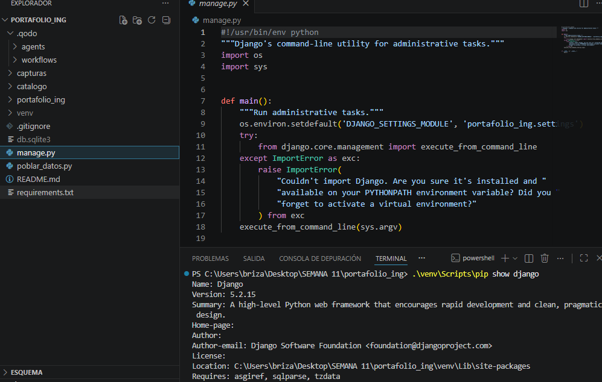
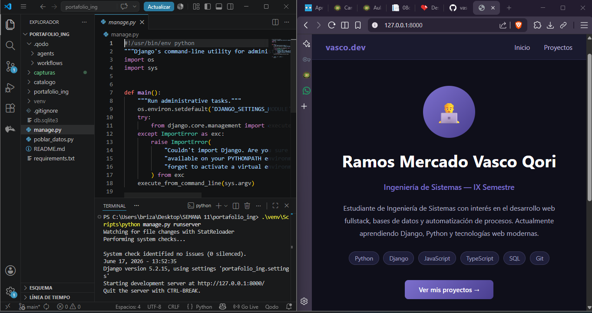
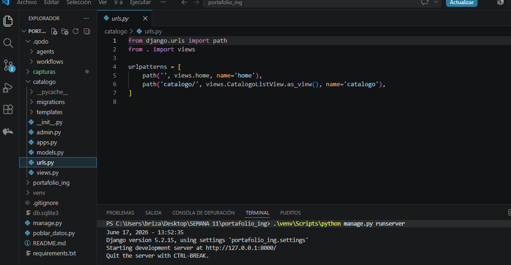
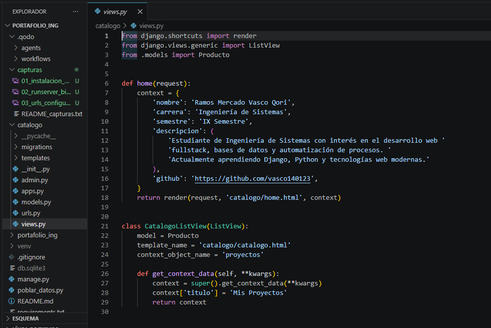
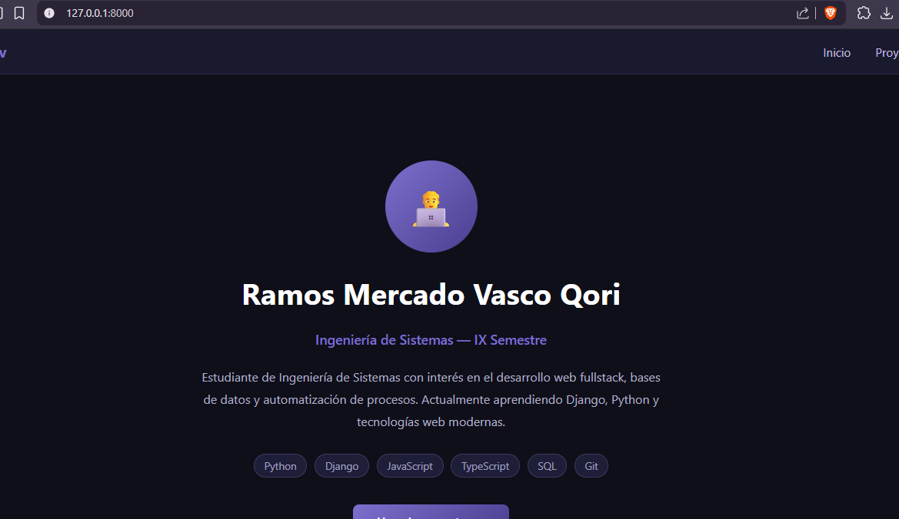
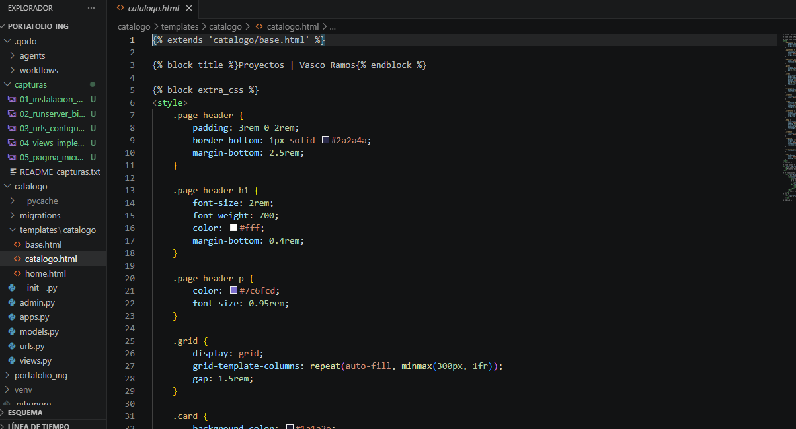
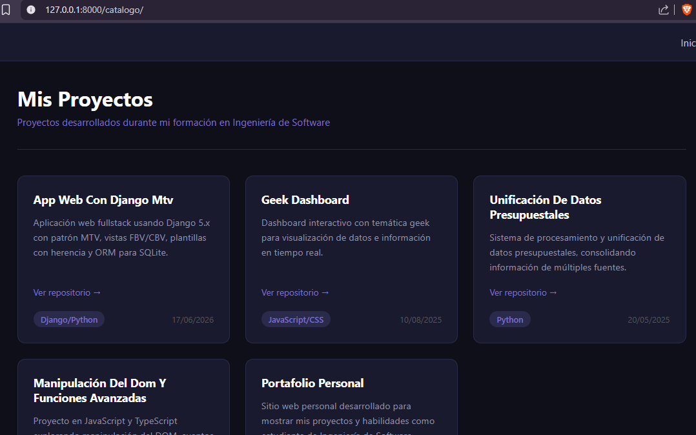

# Guía Práctica Semana 11 — Aplicación Web con Django 5.x

**Asignatura:** Desarrollo de Aplicaciones Web (IS093A)  
**Unidad:** II — Desarrollo Web Fullstack  
**Apellidos y Nombres:** Ramos Mercado Vasco Qori  
**Código de estudiante:** 2021200796I  
**Carrera:** Ingeniería de Sistemas — IX Semestre  
**Fecha:** 17/06/2026  
**Repositorio:** https://github.com/vasco140123/seman-11-web-funcional-con-Django-5.x

---

## Objetivo

Construir una aplicación web funcional con Django 5.x aplicando el patrón MTV (Model-Template-View), configurando enrutamiento con `urls.py`, desarrollando vistas FBV y CBV, implementando plantillas con herencia y filtros, y definiendo modelos con el ORM de Django para persistencia en SQLite.

La aplicación desarrollada es un **portafolio personal** como estudiante de Ingeniería de Sistemas, donde la página principal muestra mi perfil y `/catalogo/` lista mis proyectos académicos reales.

---

## Recursos utilizados

- Python 3.11.9
- Django 5.2.15
- Visual Studio Code con extensiones: Python, Django, SQLite Viewer
- Navegador Chrome + DevTools
- GitHub para control de versiones

---

## Estructura del proyecto

```
portafolio_ing/
├── manage.py
├── requirements.txt
├── .gitignore
├── poblar_datos.py
├── portafolio_ing/
│   ├── settings.py
│   ├── urls.py
│   └── wsgi.py
└── catalogo/
    ├── migrations/
    │   └── 0001_initial.py
    ├── templates/
    │   └── catalogo/
    │       ├── base.html
    │       ├── home.html
    │       └── catalogo.html
    ├── __init__.py
    ├── admin.py
    ├── apps.py
    ├── models.py
    ├── urls.py
    └── views.py
```

---

## Desarrollo paso a paso

---

### Paso 1 — Entorno virtual, instalación de Django y creación del proyecto

El primer paso fue preparar el entorno de desarrollo. Se creó un entorno virtual para aislar las dependencias del proyecto y no afectar otros proyectos en el sistema. Esto es una buena práctica en todo proyecto Django.

```bash
py -m venv venv
.\venv\Scripts\pip install django
.\venv\Scripts\django-admin startproject portafolio_ing .
.\venv\Scripts\django-admin startapp catalogo
```

`startproject` genera la configuración base del proyecto y `startapp` crea la aplicación `catalogo` donde vive toda la lógica de la app. La app fue registrada en `INSTALLED_APPS` dentro de `settings.py` para que Django la reconozca.

Se ajustó además el idioma y la zona horaria a Perú:

```python
LANGUAGE_CODE = 'es-pe'
TIME_ZONE = 'America/Lima'
```

Se verificó que el servidor arrancara correctamente ejecutando `python manage.py runserver`.

**Captura 1 — Instalación y estructura del proyecto:**


**Captura 2 — Servidor corriendo con página de bienvenida de Django:**


---

### Paso 2 — Configuración de rutas (urls.py)

Se creó `catalogo/urls.py` con dos rutas: una para la página de inicio y otra para el catálogo de proyectos. Se usó el parámetro `name` para que los templates puedan referenciar las URLs sin hardcodearlas.

```python
from django.urls import path
from . import views

urlpatterns = [
    path('', views.home, name='home'),
    path('catalogo/', views.CatalogoListView.as_view(), name='catalogo'),
]
```

En el archivo principal `portafolio_ing/urls.py` se usó `include()` para desacoplar las rutas de la app del proyecto:

```python
from django.urls import path, include

urlpatterns = [
    path('admin/', admin.site.urls),
    path('', include('catalogo.urls')),
]
```

Los templates usan `` y `` para navegar, nunca URLs escritas a mano.

**Captura 3 — Archivo urls.py de la app en VS Code:**


---

### Paso 3 — Vistas: FBV y CBV

Se implementaron dos tipos de vistas que son el núcleo de Django:

**FBV (Vista basada en función):** `home` recibe el `request` y retorna un `render()` con contexto que incluye mis datos personales.

**CBV (Vista basada en clase):** `CatalogoListView` hereda de `ListView` y automáticamente lista todos los objetos `Producto`. Se sobreescribió `get_context_data()` para agregar el título de la sección.

```python
def home(request):
    context = {
        'nombre': 'Ramos Mercado Vasco Qori',
        'carrera': 'Ingeniería de Sistemas',
        'semestre': 'IX Semestre',
        ...
    }
    return render(request, 'catalogo/home.html', context)


class CatalogoListView(ListView):
    model = Producto
    template_name = 'catalogo/catalogo.html'
    context_object_name = 'proyectos'

    def get_context_data(self, **kwargs):
        context = super().get_context_data(**kwargs)
        context['titulo'] = 'Mis Proyectos'
        return context
```

**Captura 4 — views.py con FBV y CBV en VS Code:**


**Captura 5 — Página de inicio en el navegador:**


---

### Paso 4 — Plantillas con herencia, bloques, tags y filtros

Se implementó el sistema de herencia de Django Templates:

**`base.html`** define la estructura HTML común (navbar, footer) con bloques que las páginas hijas rellenan:

```html
...
...
```

**`catalogo.html`** hereda de la base y usa tags y filtros de Django:

```html



    
        <a href="{{ proyecto.link }}">Ver repositorio →</a>
    
    {{ proyecto.nombre|title }}
    {{ proyecto.fecha|date:"d/m/Y" }}

```

- `` — hereda el layout base
- `` — itera sobre los proyectos
- `` — muestra el link solo si existe
- `|title` — capitaliza el nombre del proyecto
- `|date:"d/m/Y"` — formatea la fecha en formato peruano

**Captura 6 — base.html en VS Code:**


**Captura 7 — Catálogo de proyectos en el navegador:**


---

### Paso 5 — Modelo, migraciones y consultas ORM

Se definió el modelo `Producto` en `models.py` que representa cada proyecto académico. El ORM de Django traduce esta clase Python a una tabla SQL automáticamente:

```python
class Producto(models.Model):
    nombre = models.CharField(max_length=200)
    descripcion = models.TextField()
    tecnologia = models.CharField(max_length=100)
    fecha = models.DateField()
    link = models.URLField(blank=True)

    def __str__(self):
        return self.nombre

    class Meta:
        ordering = ['-fecha']
```

Se verificó el proyecto y se aplicaron las migraciones:

```bash
python manage.py check          # 0 errores
python manage.py makemigrations catalogo
python manage.py migrate
```

Se pobló la base de datos con proyectos reales usando `poblar_datos.py`. Ejemplo de consultas ORM usadas:

```python
Producto.objects.all()                              # todos los proyectos
Producto.objects.filter(tecnologia__icontains='Python')  # filtra por tecnología
```

**Captura 8 — Terminal con makemigrations y migrate:**


**Captura 9 — SQLite Viewer con tabla catalogo_producto:**


**Captura 10 — Estructura completa del proyecto en VS Code:**


---

## Cómo ejecutar el proyecto

```bash
# Clonar el repositorio
git clone https://github.com/vasco140123/seman-11-web-funcional-con-Django-5.x.git
cd seman-11-web-funcional-con-Django-5.x

# Crear entorno virtual e instalar dependencias
py -m venv venv
.\venv\Scripts\pip install -r requirements.txt

# Aplicar migraciones y poblar datos
py manage.py migrate
py poblar_datos.py

# Iniciar servidor
py manage.py runserver
```

Abrir en el navegador: `http://127.0.0.1:8000/`

---

## Conclusiones

- El patrón **MTV** de Django separa claramente el modelo (datos), el template (presentación) y la vista (lógica), lo que facilita el mantenimiento del código.
- Las **FBV** son simples y directas, ideales para vistas sencillas. Las **CBV** reducen código repetitivo al encapsular comportamiento común como el listado de objetos.
- La **herencia de templates** con `` y `` permite mantener un diseño consistente sin duplicar HTML.
- El **ORM de Django** abstrae el SQL permitiendo hacer consultas complejas con sintaxis Python. Los QuerySets son lazy, es decir, solo ejecutan la consulta cuando se necesitan los datos.
- Las **migraciones** permiten versionar los cambios del esquema de la base de datos de forma controlada.
